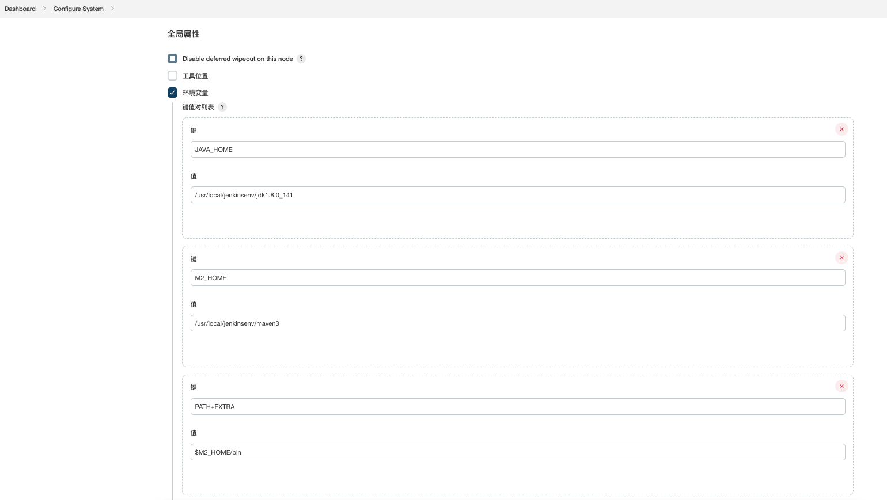
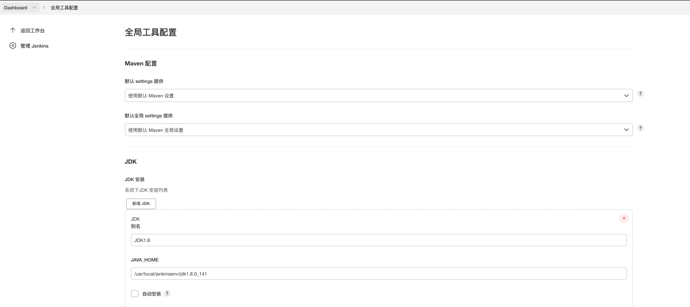
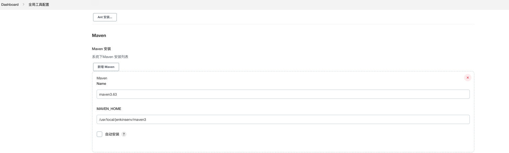
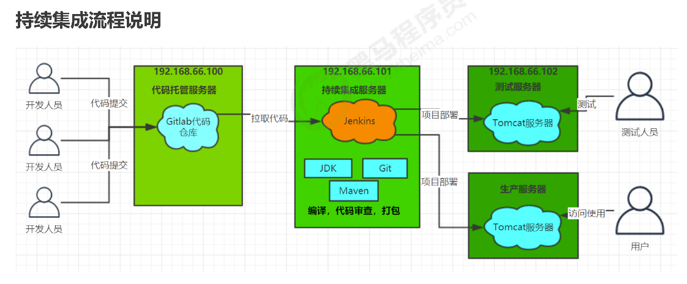

### Jenkins创建

#### 1. 介绍docker创建jenkins服务的方式  主要参考官网 [网址](https://www.jenkins.io/doc/book/installing/docker/)

--rm 可以不用选

```
docker run \
  --name jenkins-docker \
  --rm \
  --detach \
  --privileged \
  --network jenkins \
  --network-alias docker \
  --env DOCKER_TLS_CERTDIR=/certs \
  --volume jenkins-docker-certs:/certs/client \
  --volume jenkins-data:/var/jenkins_home \
  --publish 2376:2376 \
  docker:dind \
  --storage-driver overlay2
```


Create Dockerfile with the following content:

```
FROM jenkins/jenkins:2.346.1-jdk11
USER root
RUN apt-get update && apt-get install -y lsb-release
RUN curl -fsSLo /usr/share/keyrings/docker-archive-keyring.asc \
  https://download.docker.com/linux/debian/gpg
RUN echo "deb [arch=$(dpkg --print-architecture) \
  signed-by=/usr/share/keyrings/docker-archive-keyring.asc] \
  https://download.docker.com/linux/debian \
  $(lsb_release -cs) stable" > /etc/apt/sources.list.d/docker.list
RUN apt-get update && apt-get install -y docker-ce-cli
USER jenkins
RUN jenkins-plugin-cli --plugins "blueocean:1.25.5 docker-workflow:1.28"
```


Run your own `myjenkins-blueocean:2.346.2-1` image as a container in Docker using the following [`docker run`](https://docs.docker.com/engine/reference/run/) command

```
docker run \
  --name jenkins-blueocean \
  --restart=on-failure \
  --detach \
  --network jenkins \
  --env DOCKER_HOST=tcp://docker:2376 \
  --env DOCKER_CERT_PATH=/certs/client \
  --env DOCKER_TLS_VERIFY=1 \
  --publish 49000:8080 \
  --publish 50000:50000 \
  --volume jenkins-data:/var/jenkins_home \
  --volume jenkins-docker-certs:/certs/client:ro \
  myjenkins-blueocean:2.346.1-1 
```


#### 2. 配置本地Maven, JDK

进入容器docker exec -it -u root {blue ocean} /bin/bash

(1) 下载jdk

/usr/local/jenkinsenv (文档的包安装地址, 需要下载apache-maven-3.8.6-bin.tar.gz, java-se-8u41-ri)
apache-maven-3.8.6  apache-maven-3.8.6-bin.tar.gz  java-se-8u41-ri  openjdk-8u41-b04-linux-x64-14_jan_2020.tar.gz


(2) maven的配置

```
安装Maven
从官网下载apache-maven-3.6.2-bin.tar.gz, 并上传到myjenkins-blueocea容器中
tar -xzf apache-maven-3.6.2-bin.tar.gz 解压
mkdir -p /opt/maven 创建目录
mv apache-maven-3.6.2/* /opt/maven 移动文件

配置环境变量 vi /etc/profile
export JAVA_HOME=/usr/local/jenkinsenv/jdk1.8.0_141
export MAVEN_HOME=/usr/local/jenkinsenv/maven3
export PATH=$PATH:$JAVA_HOME/bin:$MAVEN_HOME/bin
source /etc/profile
mvn -v 测试成功
```

(3) jenkins 系统管理 系统配置
系统管理-系统配置

<table><tr><td>

</td></tr></table>

<table><tr><td>

</td></tr></table>

<table><tr><td>

</td></tr></table>


#### 3. 插件的安装 (版本使用稳定版, 最近版存在位置BUG)

(1) Credentials Binding(记录凭证)  Credentials Binding Plugin 版本523.vd859a_4b_122e6

(2) git(支持从gitlab拉取代码) GitLab Plugin 版本1.5.35 

(3) Email Extension(邮件发动)  Email Extension 版本2.69

(4) DingTalk(钉钉) DingTalk 版本2.4.7

(5) Publish Over SSH(通过ssh代理) Publish Over SSH 版本1.24

(6) GitLab Hook Plugin 钩子触发

(7) NodeJS Plugin node配置 [参考网站](https://www.jiubanqingchen.cn/article/23.html)


#### 4. 流程图

<table><tr><td>

</td></tr></table>


