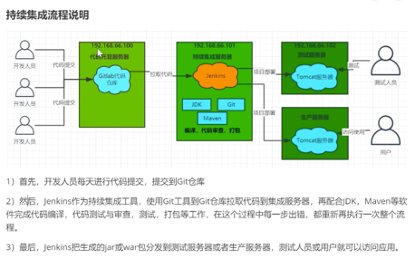

```
pipeline {
    agent any

    stages {
        stage('Build') {
            steps {
                echo 'git pull'
                // Get some code from a GitHub repository
                git credentialsId: '880bb432-d92e-4450-beb4-8bcd31aab94a', url: 'https://github.com/7jiongsh/extention_v2.git'

                sh "cp -rf /playbook/tpl/prod/application.yml extension-api/src/main/resources/application.yml"
                sh "cat extension-api/src/main/resources/application.yml"
                // Run Maven on a Unix agent.
                sh "mvn -Dmaven.test.failure.ignore=true clean package"

                // To run Maven on a Windows agent, use
                // bat "mvn -Dmaven.test.failure.ignore=true clean package"
            }

            post {
                // If Maven was able to run the tests, even if some of the test
                // failed, record the test results and archive the jar file.
                success {
                    junit 'extension-api/target/surefire-reports/TEST-*.xml'
                    archiveArtifacts 'extension-api/target/*.jar'
                    echo 'ansible playbook'
                    sh "ansible-playbook /playbook/pb-prod.yml"
                    sh "python3 /playbook/tools/yanbao_automated_test/main.py prod"
                }
            }
        }
    }
}
```

### jenkins docker创建服务器

####地址
https://www.jenkins.io/doc/book/installing/docker/
--rm 可以不用选
```
docker run \
  --name jenkins-docker \
  --detach \
  --privileged \
  --network jenkins \
  --network-alias docker \
  --env DOCKER_TLS_CERTDIR=/certs \
  --volume jenkins-docker-certs:/certs/client \
  --volume jenkins-data:/var/jenkins_home \
  --publish 2376:2376 \
  docker:dind \
  --storage-driver overlay2
```

Create Dockerfile with the following content:
```
FROM jenkins/jenkins:2.346.1-jdk11
USER root
RUN apt-get update && apt-get install -y lsb-release
RUN curl -fsSLo /usr/share/keyrings/docker-archive-keyring.asc \
  https://download.docker.com/linux/debian/gpg
RUN echo "deb [arch=$(dpkg --print-architecture) \
  signed-by=/usr/share/keyrings/docker-archive-keyring.asc] \
  https://download.docker.com/linux/debian \
  $(lsb_release -cs) stable" > /etc/apt/sources.list.d/docker.list
RUN apt-get update && apt-get install -y docker-ce-cli
USER jenkins
RUN jenkins-plugin-cli --plugins "blueocean:1.25.5 docker-workflow:1.28"
```


```
docker run \
  --name jenkins-blueocean \
  --restart=on-failure \
  --detach \
  --network jenkins \
  --env DOCKER_HOST=tcp://docker:2376 \
  --env DOCKER_CERT_PATH=/certs/client \
  --env DOCKER_TLS_VERIFY=1 \
  --publish 49000:8080 \
  --publish 50000:50000 \
  --volume jenkins-data:/var/jenkins_home \
  --volume jenkins-docker-certs:/certs/client:ro \
  myjenkins-blueocean:2.346.1-1 
```


####
/usr/local/jenkinsenv
apache-maven-3.8.6  apache-maven-3.8.6-bin.tar.gz  java-se-8u41-ri  openjdk-8u41-b04-linux-x64-14_jan_2020.tar.gz

docker exec -it -u root 831bf5f96ab7 /bin/bash

配置时system conf
不要写PATH变量


####流程图
<table><tr><td>

</td></tr></table>

####alphine linux
需要使用 apk add openjdk8