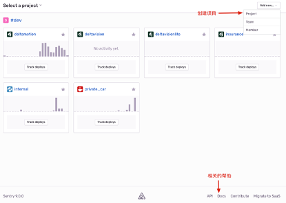

# 02 在搭建好组织的sentry之后, 进入项目管理的网站

## 一. 创建项目
在projects下根据编程语言和所属的team创建新的项目
### 参考图片如下:
<table><tr><td>

</td></tr></table>

## 二. 找到对应语言的安装模块在项目中配置
具体内容可以在Docs的文档中看到

## 三. 针对java springboot的最佳实践在github代码已经Fork
参考地址如下:
https://github.com/yiligeng/springboot-sentry-demo

## 四. 需要配置DSN, 在项目setting中可以找到

## 五. 注意事项

不同的代码和框架等具体的方式需要查看Docs文档和github最佳实践

如果您遵循本指南的制作流程而发现有问题或可以改进的流程，请提出 Issue 或 Pull request 。
